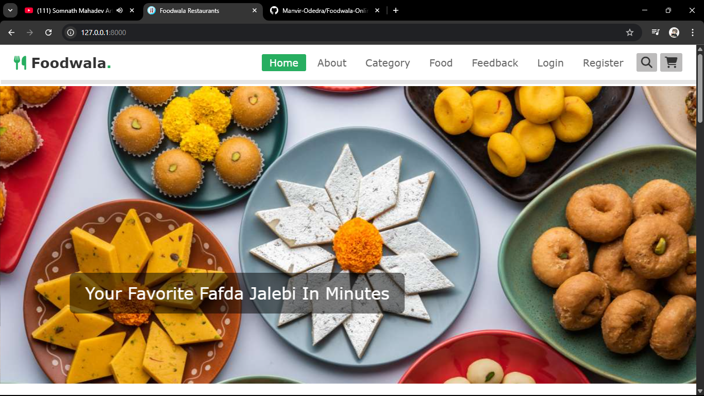

# Foodwala-Online-Food-Ordering
Foodwala – An online food ordering web application built with Django, Python, and PostgreSQL. Features include user authentication, dynamic menu browsing, a full cart system, order management, and deployment-ready Git integration.

# Foodwala

**An online food ordering web application built with Django, Python, and PostgreSQL.**

## Features
- ✅ User registration & authentication  
- 📂 Browse dynamic food menus with categories & images  
- 🛒 Add items to cart with adjustable quantities  
- 🧾 View cart, place orders, and track totals  
- 🔐 Secure backend with PostgreSQL & Django ORM  
- 🚀 Ready for deployment via Git

Built with love 🧡 for foodies and developers alike.

# Website Design

